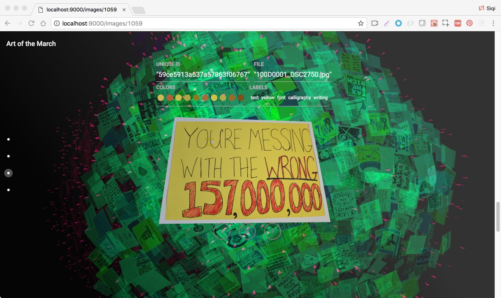
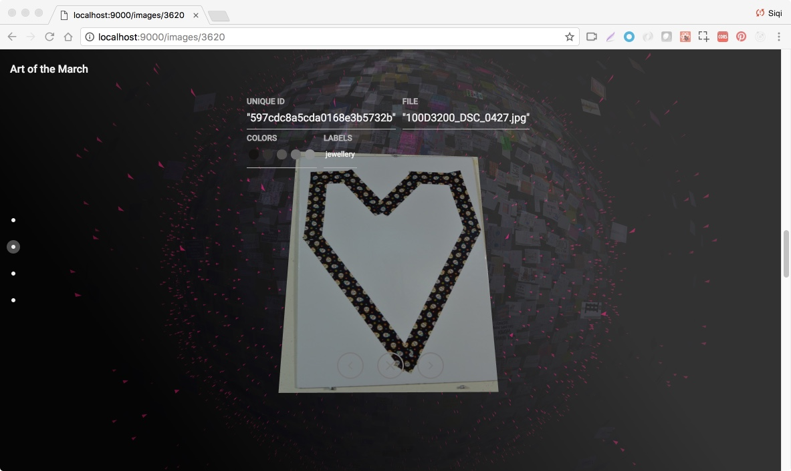

This design research project attempts to develop alternative ways of analyzing political speech, specifically through the 6,000 hand-made signs collected at the Boston Women’s March in 2017. Working with Dietmar Offenhuber and a team of other researchers at Northeastern University, I developed a data-driven application that facilitates the visual exploration of this large graphic archive, as well as more detailed thematic and semantic analysis and comparisons.

The project was shortlisted as one of the best data visualization projects by Kantar _Information is Beautiful_ award in 2018

