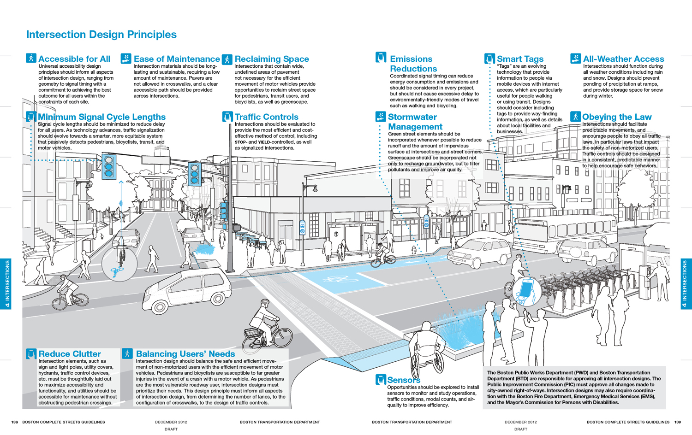
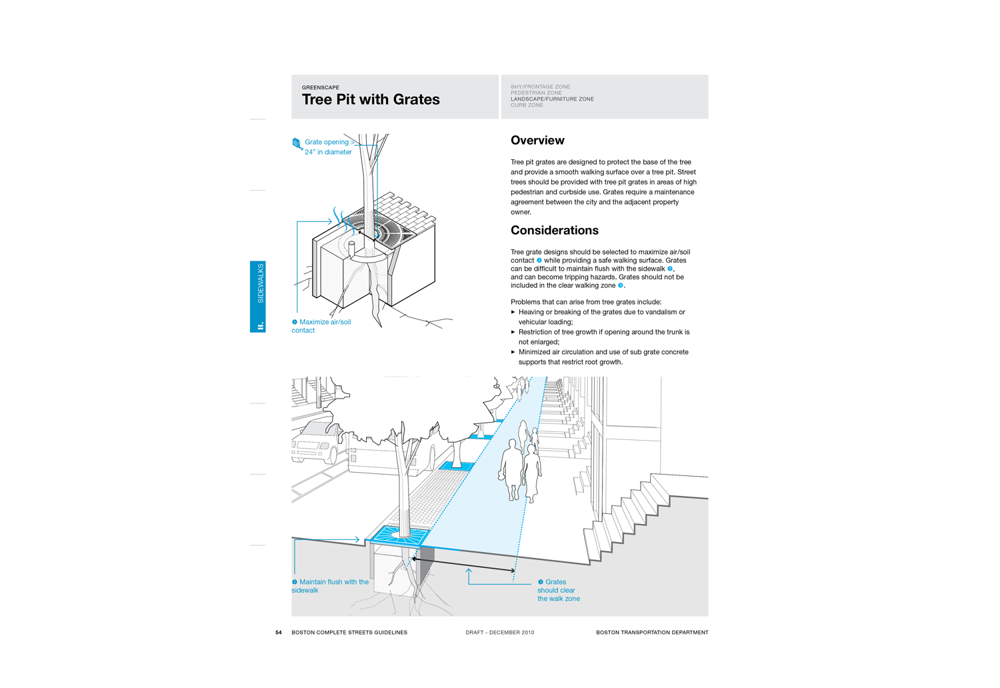
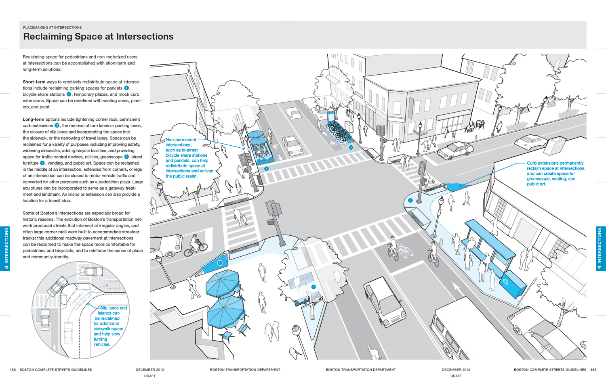
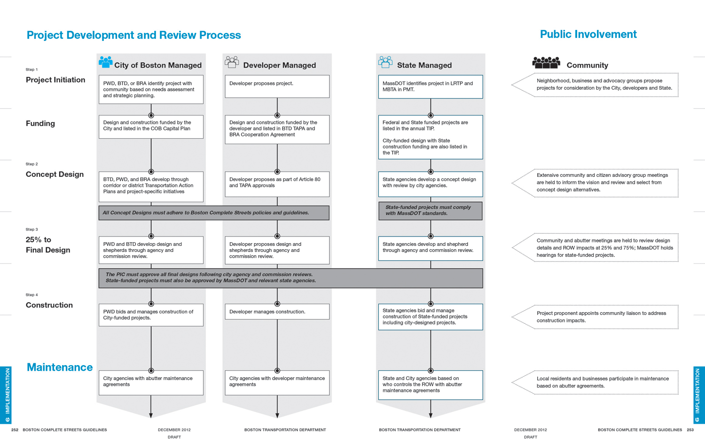

The Boston Complete Streets initiative encompasses a 500-page illustrated manual and a [website](http://www.bostoncompletestreets.org), and is among the most comprehensive, up-to-date (and visually compelling) streetscape design standards in the country. It not only addresses the physical dimension of designing great streets, but also covers operations management, regulatory implementation, and the use of digital technology. As the lead designer for this project, I conceptualized and developed the Guidelines' distinctive visual language that is capable of both communicating technical detail and engaging the general public.

The Boston Complete Streets guidelines won the 2015 APA National Award for communication design.

