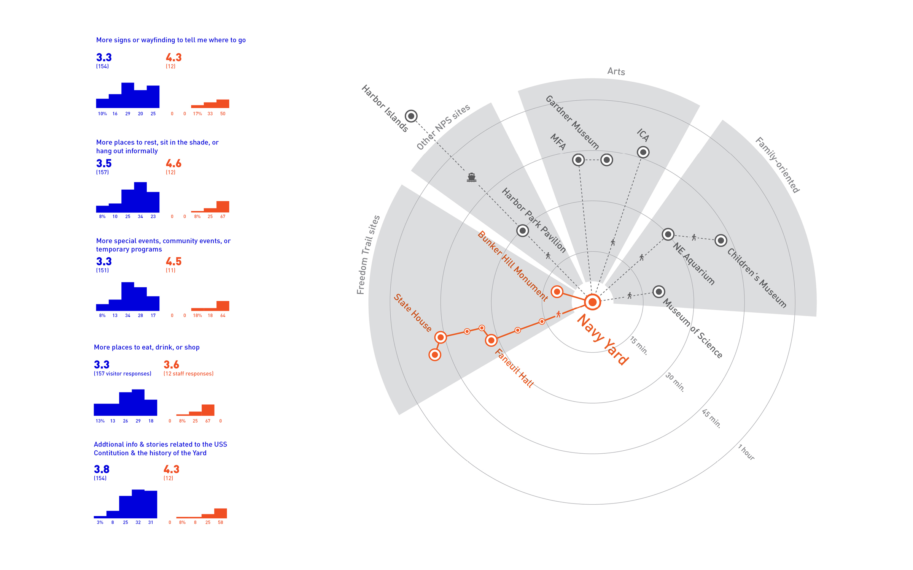
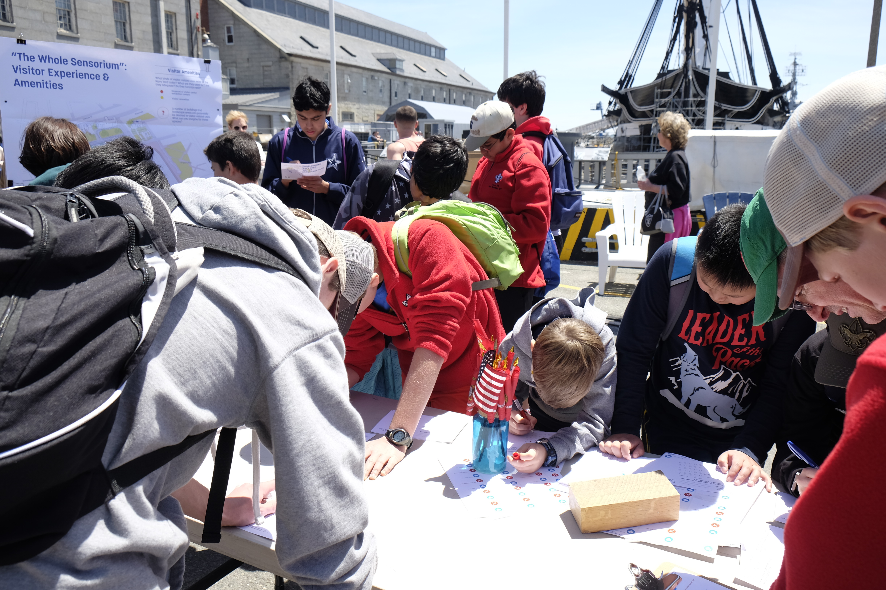
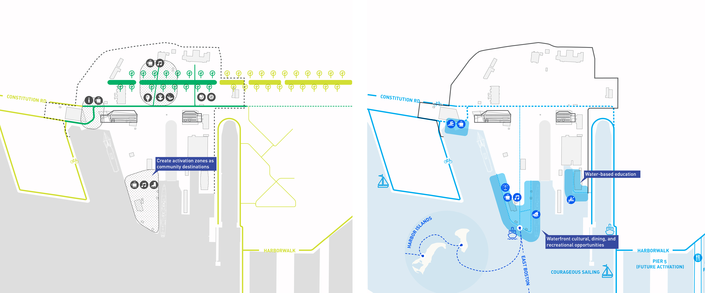
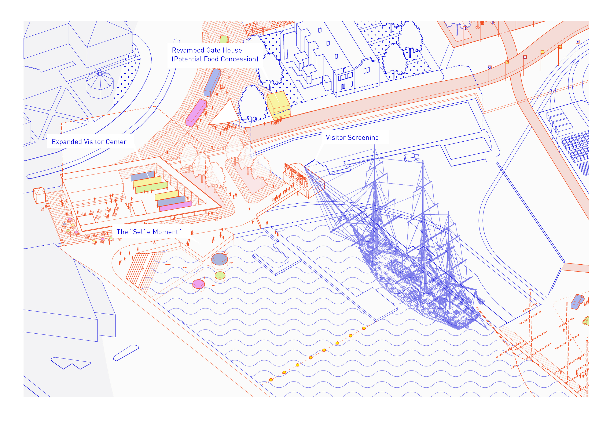
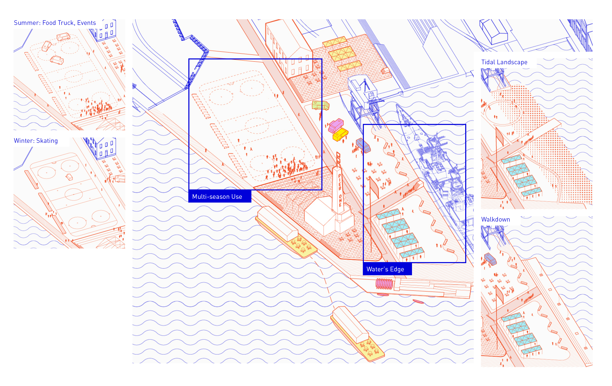

At [Sasaki](http://www.sasaki.com), I worked with the National Park Service and the USS Constitution Museum to reimagine the visitor experience at Charlestown Navy Yard, home to the famed frigate _USS Constitution_, one of the country's preeminent historical attractions. As the project manager, I oversaw a study that focused on transforming this historic National Park site into both an innovative visitor experience and a forward-looking urban public realm destination. 

The study culminated in a strategic vision for design interventions and capital improvements, innovative ideas for education and outreach programs, as well as a governance strategy that brings disparate stakeholders--NPS, the USS Constitution Museum, the Navy, the City, and the community--together for the first time.

<h4>Data-driven user experience research</h4>

I undertook a data-driven UX research process that aimed to understand why people come to the Navy Yard, what they do once they are here, and what they hope to be able to do in the future. The exercise included interviews, surveys and collaborative mapping, and large-scale data parsing of visitor reviews.

<h4>Strategic Recommendations</h4>

Key to the Navy Yard's future is collaboration among diverse stakeholders: the National Park Service, the City of Boston, the USS Constitution Museum, and the Navy all have a claim to the site. I fostered consensus among this group, and solidified this consensus into long-term strategic recommendations.

