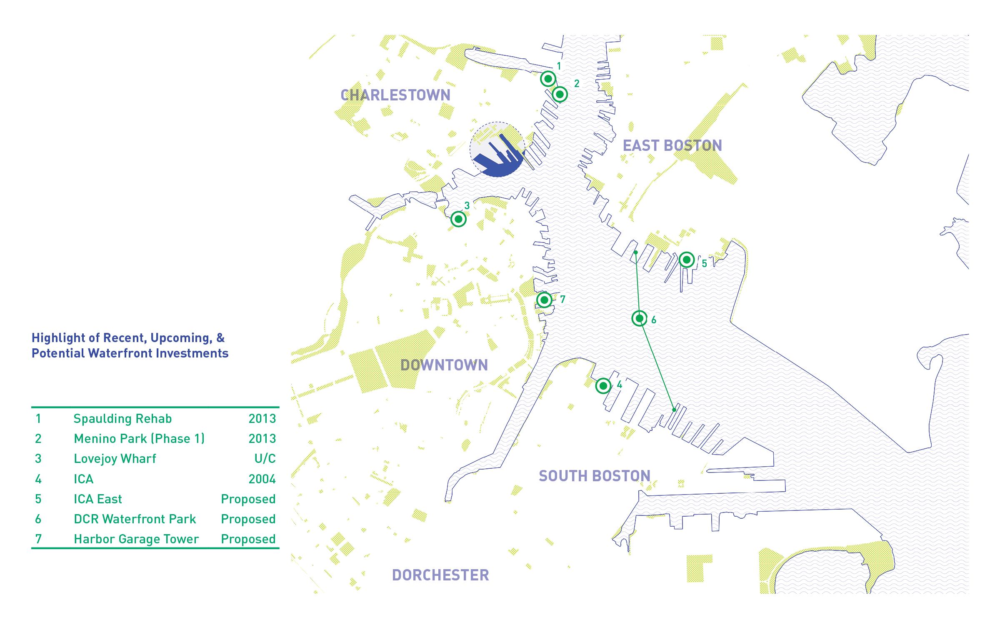

[Sasaki](http://www.sasaki.com) worked with the National Park Service and the USS Constitution Museum to reimagine the visitor experience at Charlestown Navy Yard, home to the famed frigate _USS Constitution_, one of the country's preeminent naval attractions. As the project manager at Sasaki, I oversaw the study, which focuses on transforming this 30-acre park campus on a prime stretch of the downtown Boston waterfront into a vibrant and forward-looking urban waterfront experience. The study culminated in a high-level design vision for the site, strategies for greater connectivity with the rest of the city, innovative ideas for education and outreach programs, as well as a future governance strategy that brings disparate parties--NPS, the Museum, the Navy, the City, and the community--together for the first time.

