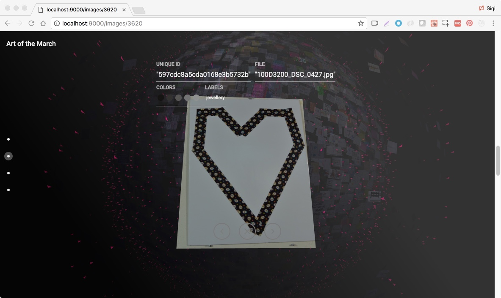

Over the years, I’ve developed and collaborated on data design projects that explore the potential of data visualization as a form of political intervention. 

<h4>Art of the March</h4>

With [Alessandra Renzi](https://www.concordia.ca/artsci/coms/faculty.html?fpid=alessandra-renzi), [Dietmar Offenhuber](https://camd.northeastern.edu/faculty/dietmar-offenhuber/), and a team of other researchers at Northeastern University, I developed a data visualization project to study the large corpus of protest signs at the Boston Women’s March in 2017 after the election of Donald Trump as US president. We used the visualization to perform image and semantic analysis of the signs, as a way to parse the political demands that brought together the anti-Trump coalition.

The project was shortlisted as one of the best data visualization projects by Kantar Information is Beautiful award in 2018, and was covered in national media such as NPR and the Atlantic.