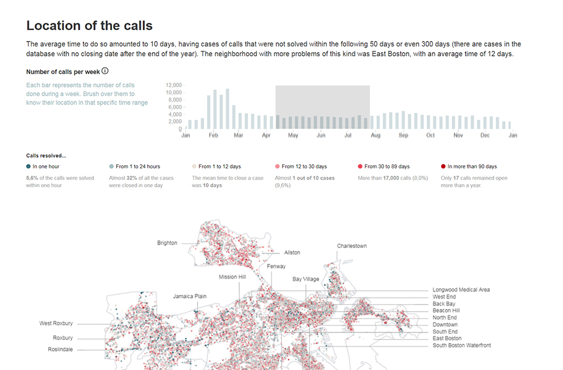

Through design research projects, exhibition work, and teaching (at Northeastern’s IDV and Harvard MDE programs), I’ve been exploring the possibilities of data visualization as a new “way of knowing”. The projects below exploit data visualization’s power to generate new knowledge, discourse, and activism, particularly as they relate to my core domain of interest, urbanism.

")

Below are examples of student work, in which I trained students to use data visualization as a tool for urban research into key issues of our day, such as housing affordability and equity in municipal services provision.

