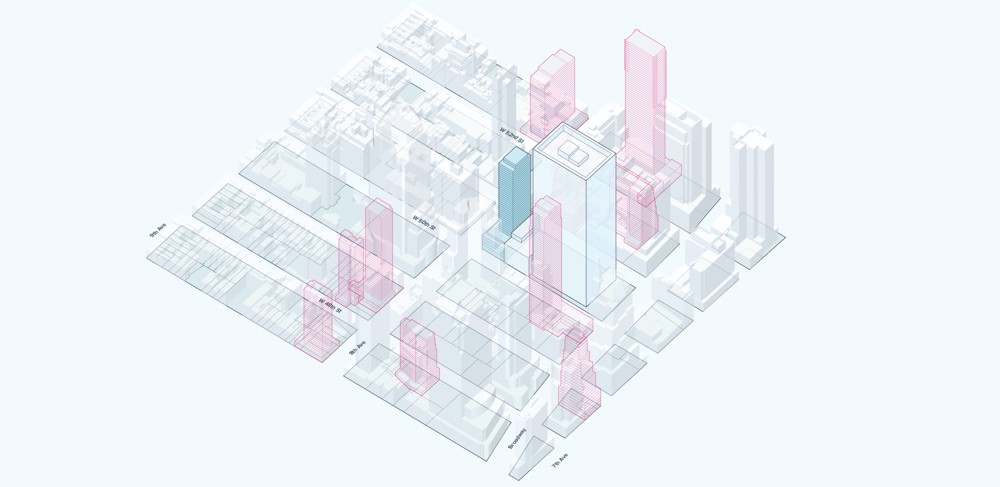

I led product development at [Envelope.city](https://envelope.city/), a software startup co-founded by Sarah Williams of [MIT Civic Data Design Lab](https://civicdatadesignlab.mit.edu/) and [SHoP architects](https://www.shoparc.com/). Envelope.city programmatically generates and visualizes massing scenarios based on New York City’s complex zoning resolution, dramatically simplifying answers to the question of “what can I build” at the lot, neighborhood, and city-wide scales.

## Launching Envelope's spec search product

I led early concept, research, product strategy, design, and launch of Envelope’s “spec search” product, which empowers real estate users to find development sites based on specific and potentially complex criteria. 

A sample criteria might be "find a site that can accommodate at least 100 residential units plus ground floor retail, located on a major avenue within 5 minutes of a subway, that can also potentially tap into at least 10,000 ZFA of adjacent air rights". 

## Outcome: a new business model for Envelope.city

Spec search enabled a successful business transition for Envelope from a pure SaSS design software to a hybrid SaSS/consulting model targeted at high-value real estate customers.

