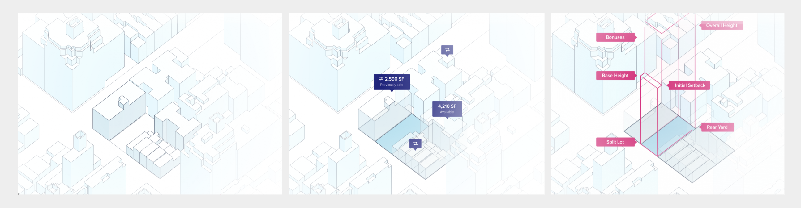
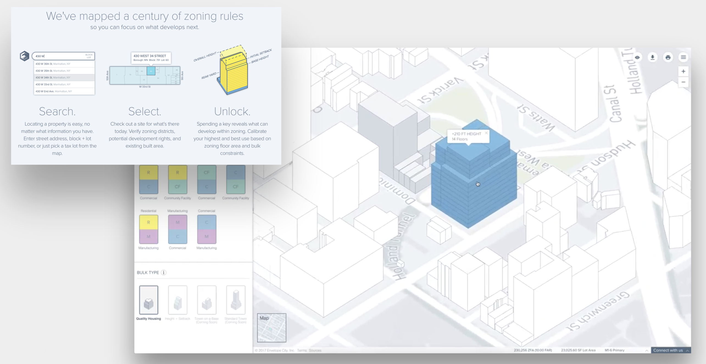

I led product management and design at [Envelope.city](https://envelope.city/), a software startup co-founded by Sarah Williams of [MIT Civic Data Design Lab](https://civicdatadesignlab.mit.edu/) and [SHoP architects](https://www.shoparc.com/). The software parametrically generates massing study scenarios based on New York City’s complex and arcane zoning resolution, dramatically simplifying the process of assessing development potential at the lot, block, neighborhood, and citywide scales.

I led the research, scoping, prioritization, and design of new product features, including a new “development opportunity search engine”. I worked with Engineering to ensure the timely release of feature, and worked with the CEO to engage customers and steer the company’s strategic priorities.

