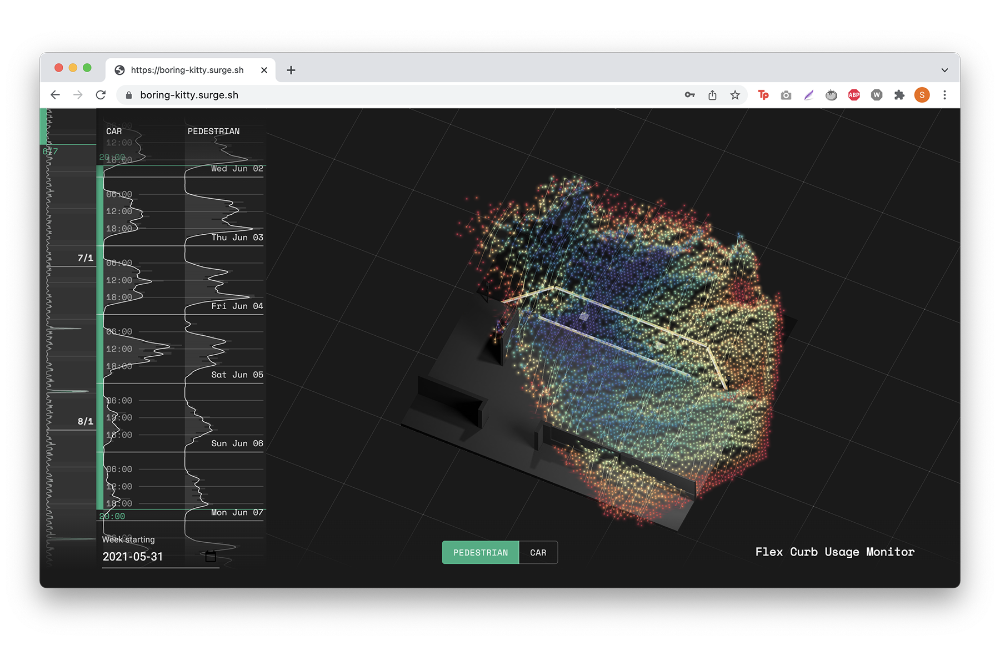

Through 2020-2021 at Sidewalk Labs, I led a technology prototyping and incubation program focused on “street of the future”. Working with corporate partner Colas, we conducted early market and customer research, produced concept designs for a number of key use cases such as curb management, pedestrian safety, and V2X interaction, and took the _Flex Curb_ into a real world pilot. My role spanned program management and partnership development, product definition and roadmap, design, and the prototyping of the entire software layer.

_More images forthcoming_

