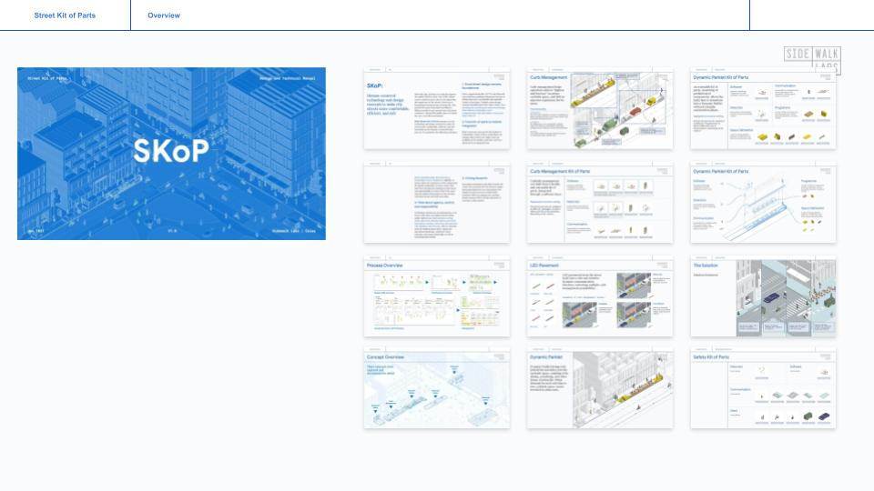
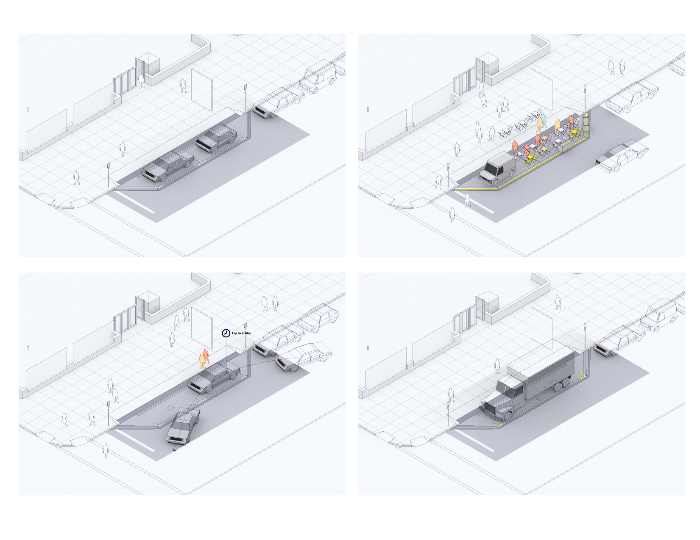
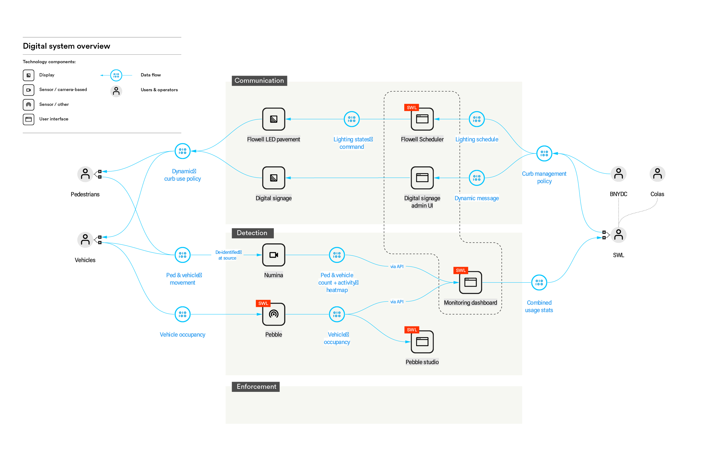

Through 2019-2021 at Sidewalk Labs, I led a design, technology prototyping, and incubation program focused on “street of the future”. In all their complexity and contradiction, streets have long been a domain of interest for urban technologists; this program focuses on how to design streets of the future as both a dynamic space for the social life of the city and a platform for evolving technologies of mobility, logistics, energy, sensing, and autonomous intelligence.

<h4>Envisioning a "Street Kit of Parts"</h4>

I led a design research project with [Colas](https://www.colas.com/en) (one of the world’s largest road builders) and Arup to define the problems, use cases, and potential design and technology concepts on the future urban street. The process tightly focused on real-world user needs, and followed rapid cycles of ideation, visualization, and feedback to achieve problem-solution fit. The resulting concepts addressed use cases such as curb management, pedestrian safety, and V2X interaction, based on a “kit of parts” design approach that reflects the accretive nature of how infrastructure and technology evolve.

 and kit of parts breakdown")

<h4>Concept → Real World: The Flex Curb Prototype</h4>

In 2020, we secured a site at Brooklyn Navy Yard to bring one of the SKoP concepts–curb management–into a real world pilot. The Flex Curb prototype focuses on enabling flexible curbside use by turning the street itself into a communication interface and allowing operators to measure and respond to real-time patterns of curbside use.

The prototype also has important meta-objectives: to build a real-world hybrid digital-physical system that seamlessly integrates 3rd-party technology components within a physical site; to understand the unique challenges therein; and to create tools and methods for building future cyber-physical systems.

<h4>Designing for Cyber-physical Systems</h4>

The mutual constraints that physical space and digital technology exerts on each other requires technologists and builders to work off a common basis-of-design. I created _digital integration diagrams_ for exactly that purpose, and these illustrate the nature of digital components, the communication relationships among them, and their dependency on the physical world–essentially an alternative knowledge graph representation of the whole system distinct from conventional construction drawings.

<h4>An Open Digital Architecture</h4>
I also programmed a set of public APIs for the Flex Curb that will allow various current and future technologies to interact with the prototype. For example, one can use a controller to activate and schedule communication patterns. The same capability will, for example, allow the prototype to synchronize with the arrival and departure of AVs in the future, pointing to the idea that an open digital architecture based on common protocols is key to evolving technological use cases for the future street.

<h4>Design Brief for the Future</h4>
The “streets of the future” program generated more questions and design briefs for the future: the need for a “digital ontology” of urban streets; the need for common protocols among IoT-based technologies working in the public realm; and new human-machine-infrastructure interaction paradigms. Finally, the program highlighted the direction for a new form of design practice that works fluidly across the physical-digital divide.