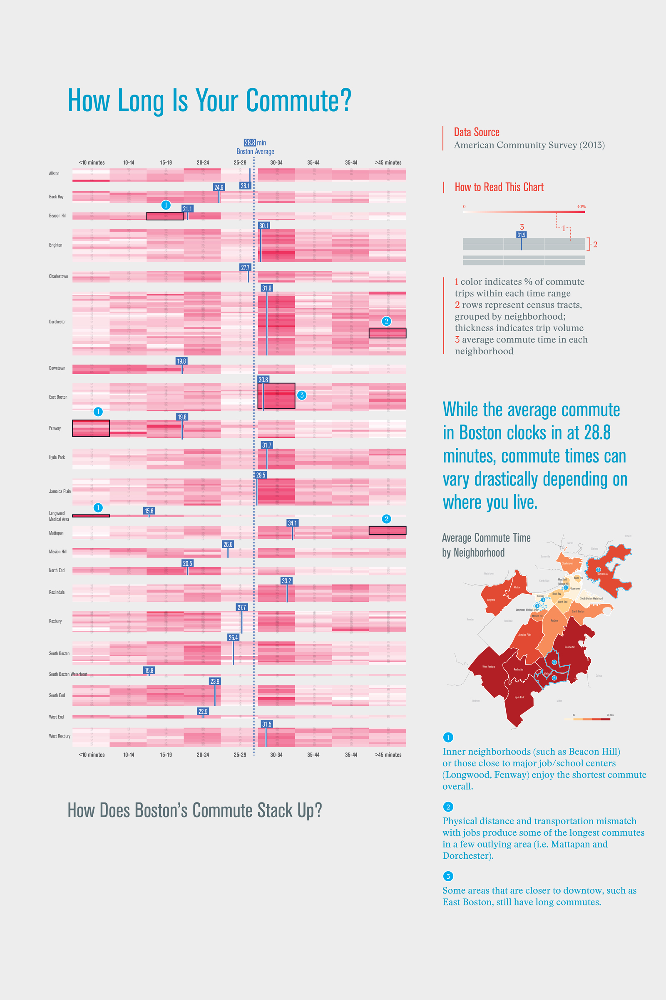
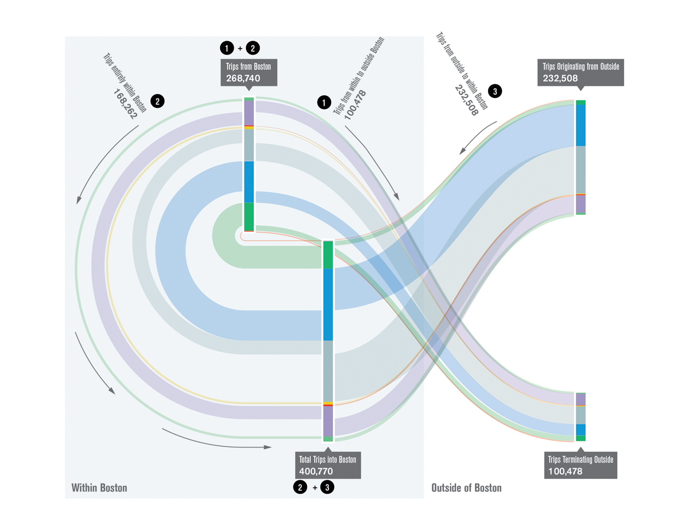
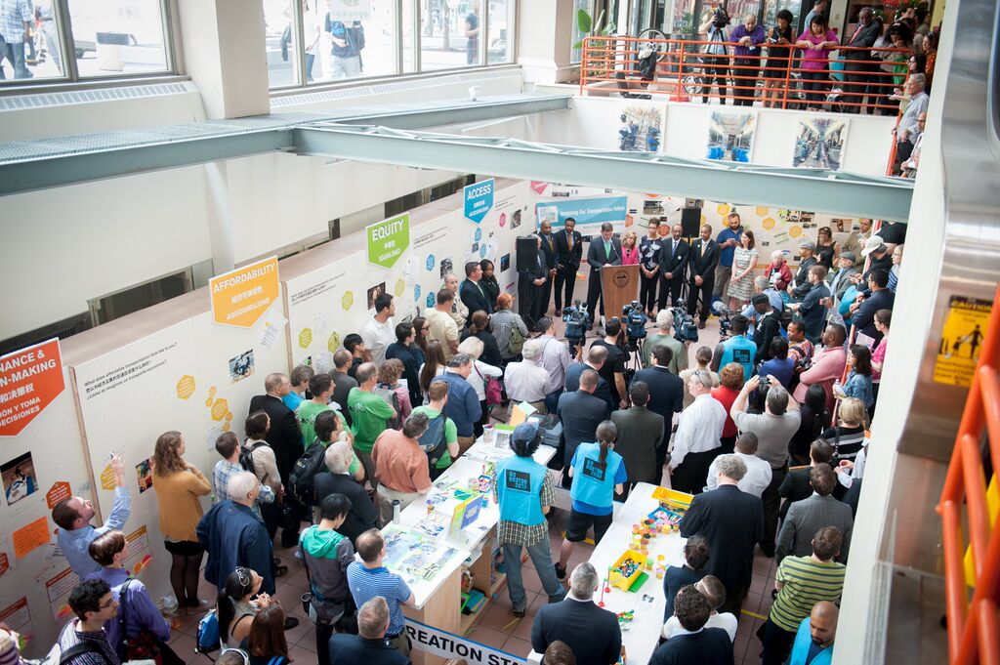

As lead designer at [Utile](http://www.utiledesign.com), I worked with a team led by Boston Transportation Department to develop _Go Boston 2030_, the city's 20-year strategic mobility plan. 

<h4>Making sense of urban mobility through data</h4>

The plan was widely lauded for its innovative use of data to map Boston's mobility challenges and elucidate the complex relationship between urban mobility and issues of housing, jobs and economic development, and racial equity. I led the data analysis effort and developed digital tools that allowed planning professionals to visually explore the resulting insights.

")

 are concentrated in areas well-served by hub-and-spoke transit systems, blue collar jobs (red) are more spread across the urban periphery, imposing additional cost burdens on workers who need to get to them")

<h4>Building insights with the community</h4>

I translated learnings from the data analysis effort into engaging visualizations for the public, creating a forum in which a city-wide community can debate mobility issues and collectively chart a path forward.

