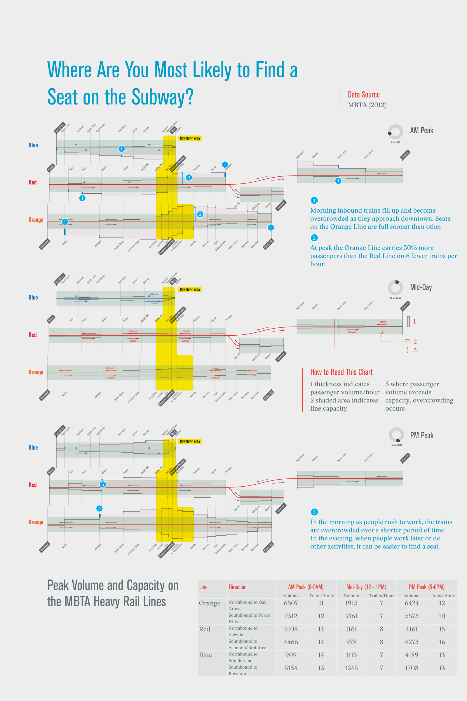

As lead designer at [Utile](http://www.utiledesign.com), I worked with Nelson Nygaard (transportation planning) and IISC (public engagement) on _Go Boston 2030_, Boston's 20-year strategic mobility plan for the entire city. I led the effort to collect, analyze, and visualize data in order to communicate and predict the complex mobility needs of the city in the future. I developed digital tools to clarify these issues both to transportation professionals and the larger public. The resulting insights shed light not only on transportation per se, but also on the complex relationship between physical and economic mobility, equity, and environmental justice.

")

 are concentrated and well-served by public transit, lower-paying blue collar jobs (red) are more spread, imposing additional transportation cost burdens on workers who need to get to them.")

