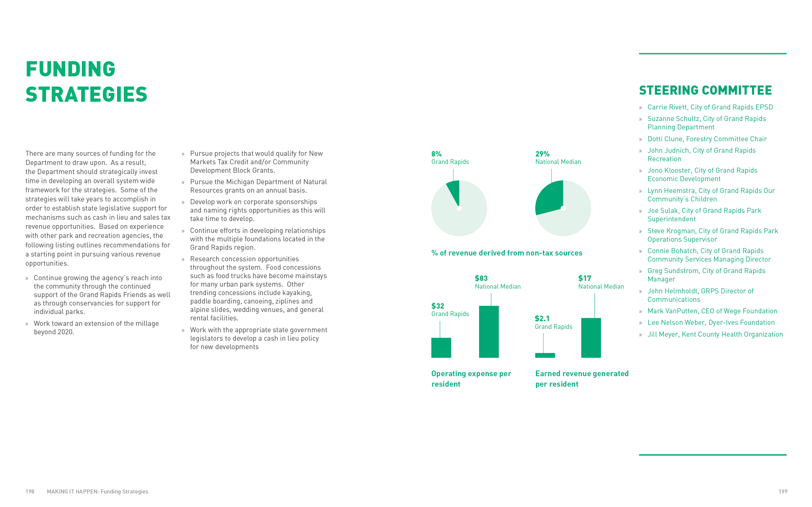

As project manager at [Sasaki](http://www.sasaki.com/), I worked with the City of Grand Rapids and HR&A Advisors to develop a long-term strategy for the design, enhancement, operation, management, and funding of the city's Parks Department as it emerges from a long period of disinvestment. The study focuses on developing actionable projects and building partnerships with the city’s philanthropic and private sectors, with guidance from the city’s wider citizenry. A robust stakeholder engagement process lay the foundation for the successful implementation of the project.

