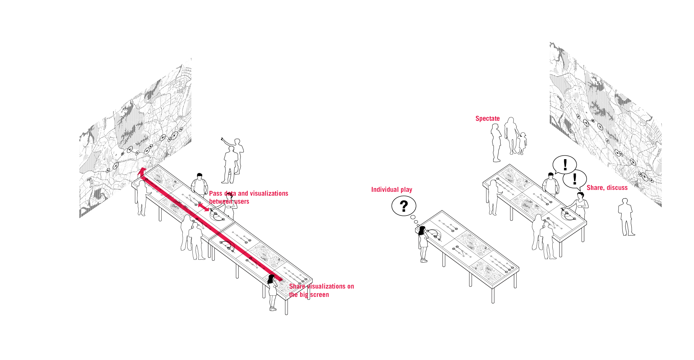
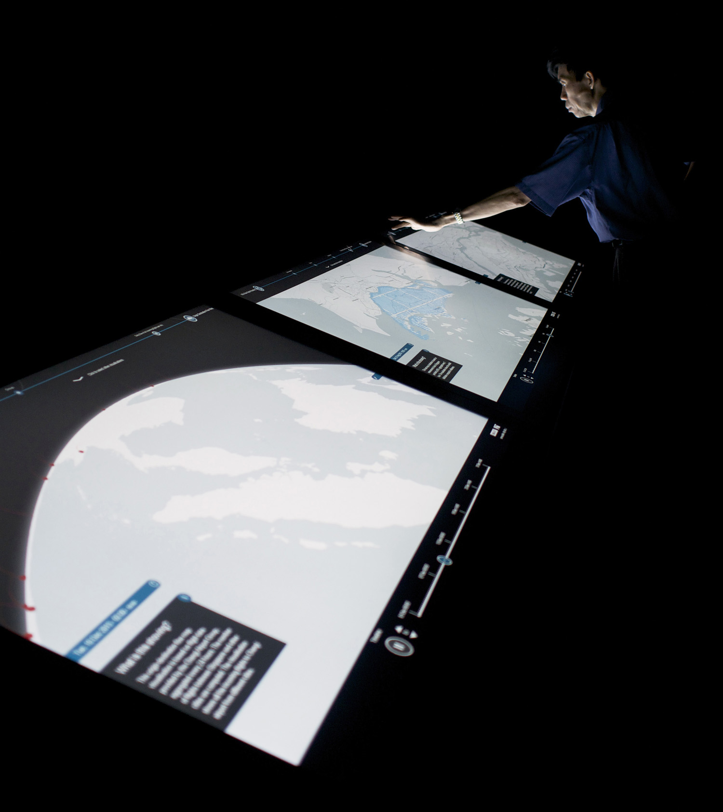
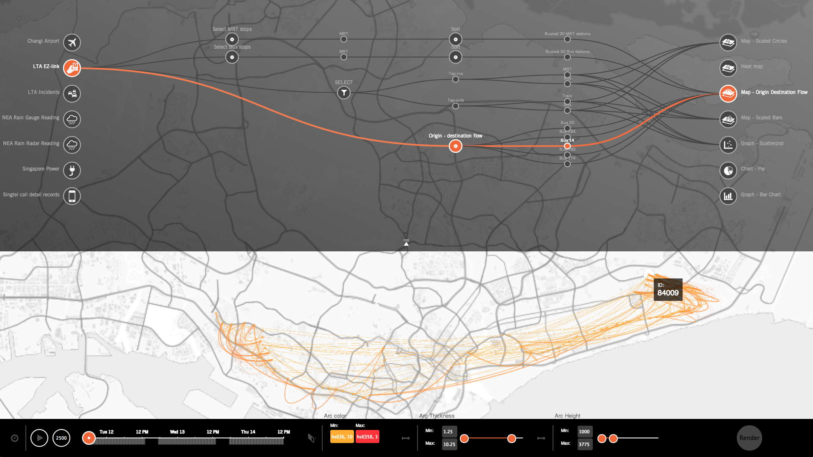
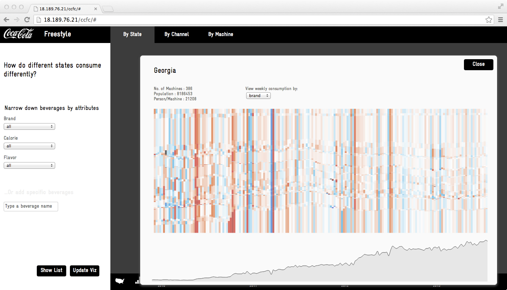
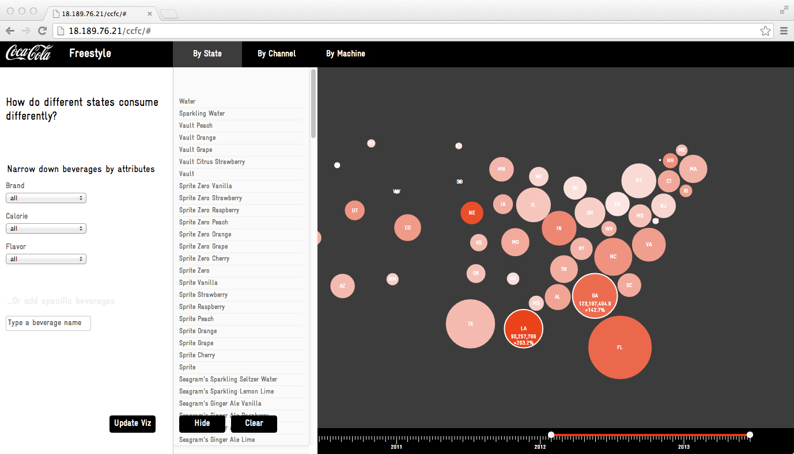

As an expert in data visualization and data-driven digital products at MIT Senseable City Lab, I led the concept development, design, and delivery of technology prototypes that explore new ways of making large urban data sets more engaging, understandable, and actionable.

<h4>DataCollider</h4>

DataCollider was a joint software development project between the Lab and the Government Singapore, which allowed access to massive data streams from the city state’s transportation, energy, and communication networks. The software provided an engaging interface for visualizing, composing, correlating among, and building insights into these data streams. I led the development of this data interface, including [a public instantiation](https://senseable.mit.edu/datadrives/) at the National Museum of Singapore.

<h4>Coca Cola data browser</h4>

The beverage consumption patterns of millions of consumers was made legible in this collaboration with Coca Cola. I designed a software prototype for a “data browser” that allows fluid visual exploration of behavioral data at a range of spatial and temporal resolutions. 

