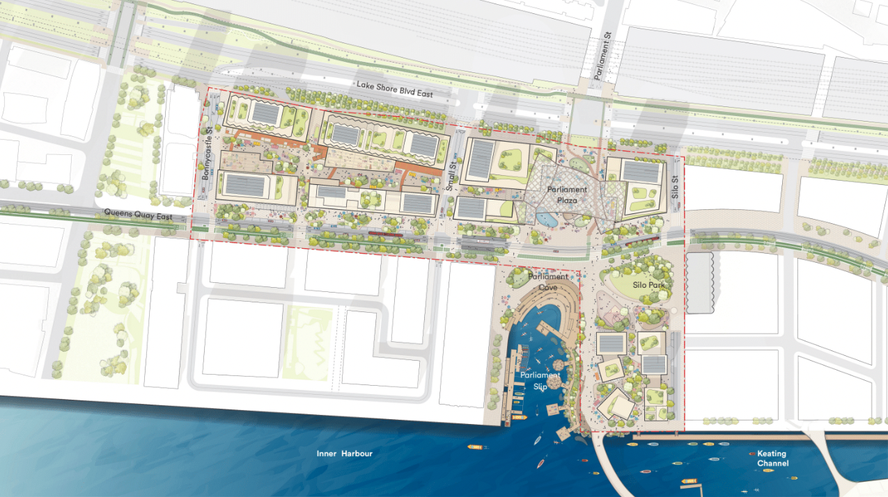
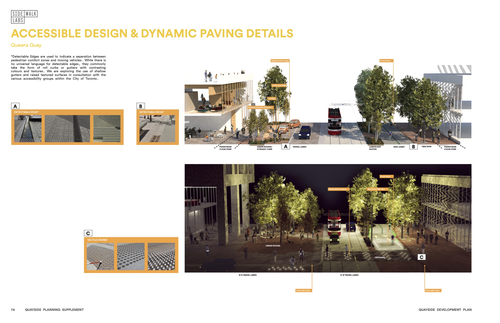

I was part of the Sidewalk Labs team that oversaw the development of the Quayside, a 12-acre, ~3 million SF urban development project in Toronto that demonstrated some of the most cutting-edge ideas in sustainable city-building.

As Associate Director of Public Realm and Urban Design, I led the project’s horizontal elements, including Parliament Plaza, Queens Quay, and the amphibious public spaces around Parliament Slip; and overseeing the integration of technology within these elements, including mobility management, public realm sensing, heated pavements, and various other innovations.

