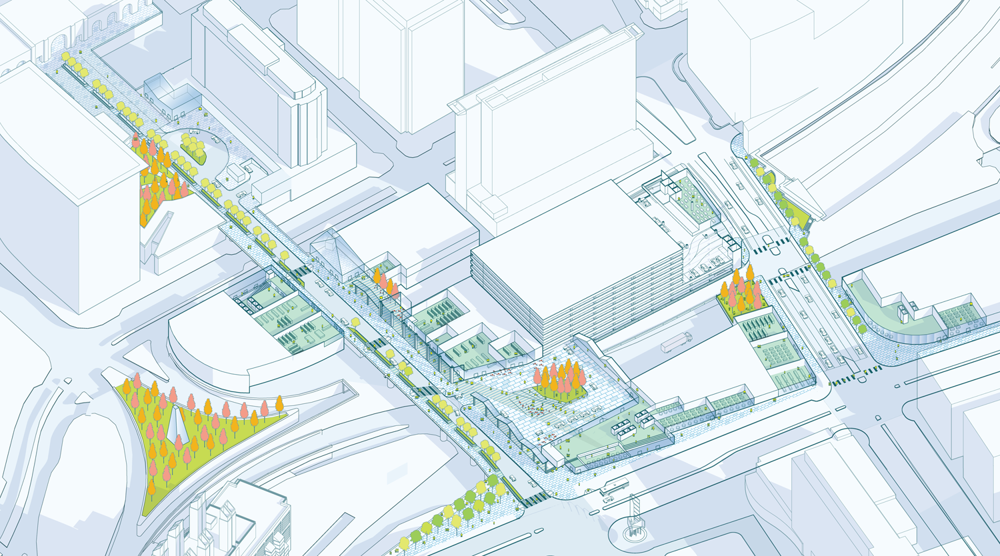

As project manager and urban designer at Sasaki and Utile, I’ve been engaged in several high-profile planning and real estate development projects in Boston’s Seaport district. My work involved leading the urban design component (planning framework, massing studies, public realm, mobility, and infrastructure) of a long-term strategic expansion plan of the Boston Convention and Exhibition Center; a comprehensive reimagining of the public realm around the World Trade Center; and WS Development’s Seaport Square project, Boston’s largest private real estate development project to date.

")

")