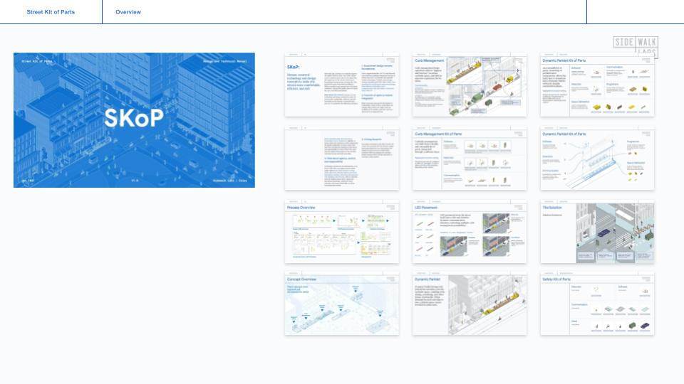
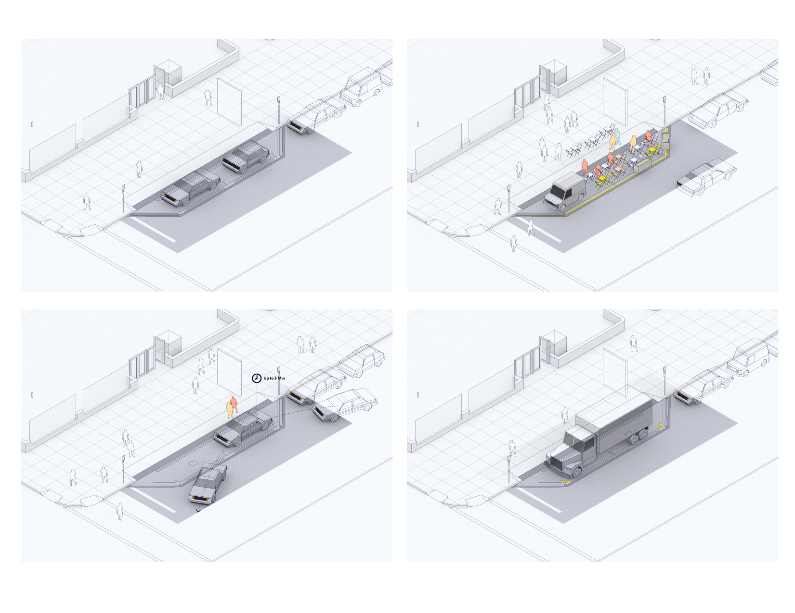
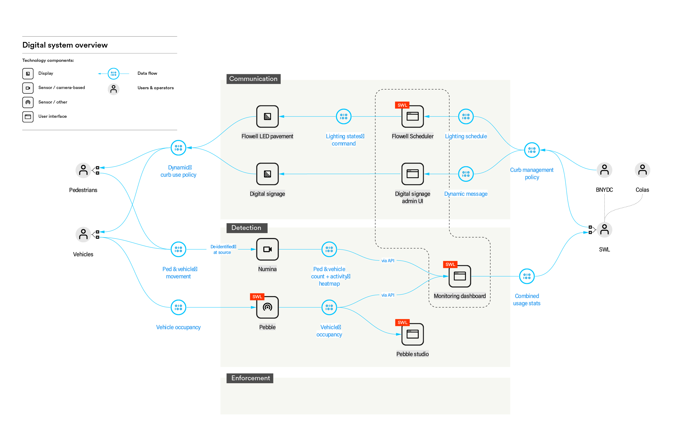
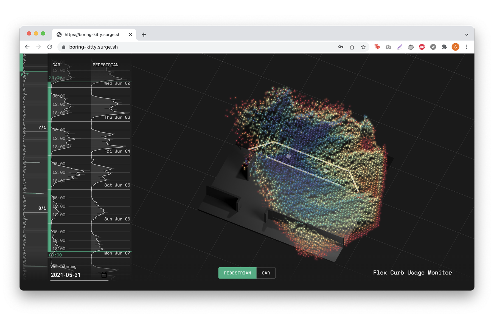

I led a ~$1 million R&D program at Sidewalk Labs, focused on envisioning “urban streets of the future” as both a space for the dynamic social life of the city and a platform for evolving technologies of mobility, logistics, energy, and sensing. The program involved many domain experts, technology partners, and consultants, and my role spanned vision and strategy, program management and execution, design, and digital prototyping.

<h4>Designing Purposeful, Human-centered Use Cases</h4>

The program starts with real-world needs and desired human-centered outcomes, and builds purposeful use cases for technology around these outcomes. With Colas and Arup, I undertook a strategic design process that resulted in use cases built around flexible curb space use, pedestrian safety, and vehicle charging.

 and kit of parts breakdown")

<h4>Concept Design for the Flex Curb</h4>

One of the use cases resulted in the Flex Curb, a technology concept to enable dynamic curb space use by allowing the street surface itself to communicate, using new sensing and LED pavement technologies.

<h4>Designing for Digital-Physical Systems</h4>

A meta-objective for the Flex Curb is to build a hybrid digital-physical system in the real world, integrating disparate technology components within a physical site and a common digital and operational overlay. 

<h4>Digital-physical Prototyping</h4>

We secured a site at Brooklyn Navy Yard to bring the Flex Curb concept to life. The prototype involved a real-world installation of Colas’s Flowell LED pavement, as well as a set of APIs and software apps for visualization and control, which I prototyped.

<h4>Future Design Briefs</h4>

The “streets of the future” program generated more R&D briefs for the future: the need for a “digital ontology” of the urban public realm to allow integration among IoT-based technologies; new design paradigms for human-technology-infrastructure interactions, and finally, the need for a new kind of integrative design capacity that can work on digital-physical systems, that can effectively combine the design of spaces, UX, services, and organizations with technology assessment and prototyping.